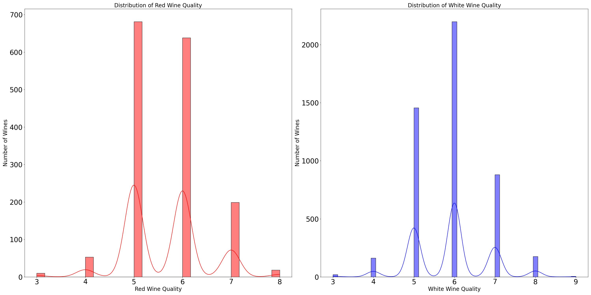
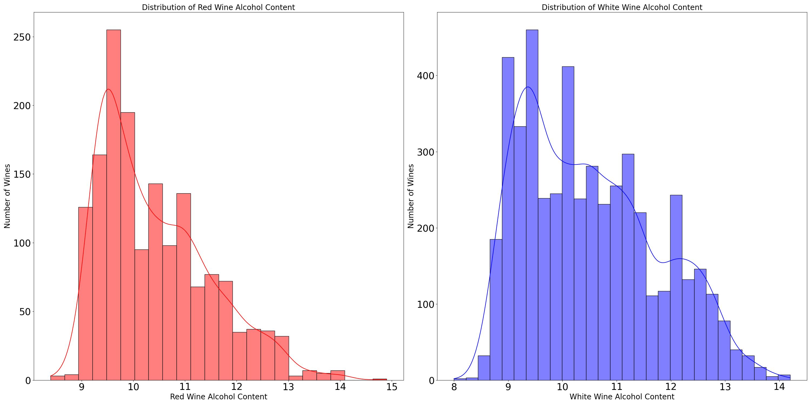
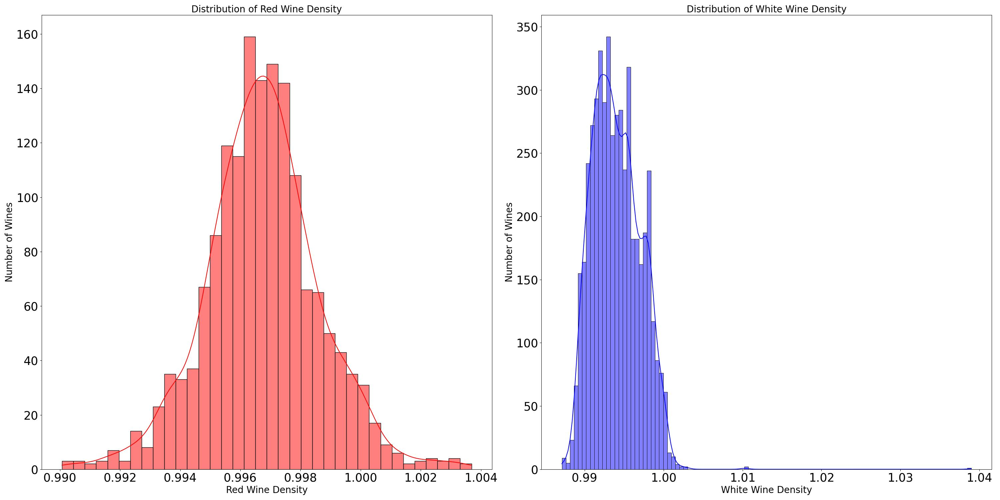
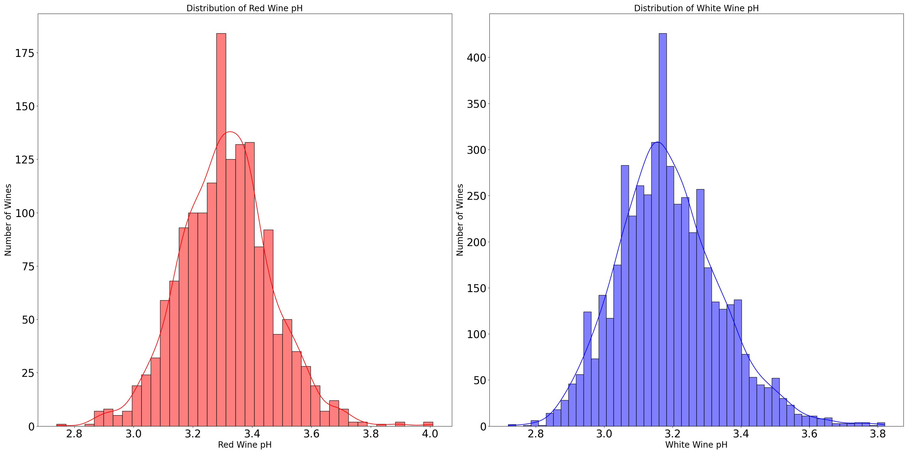
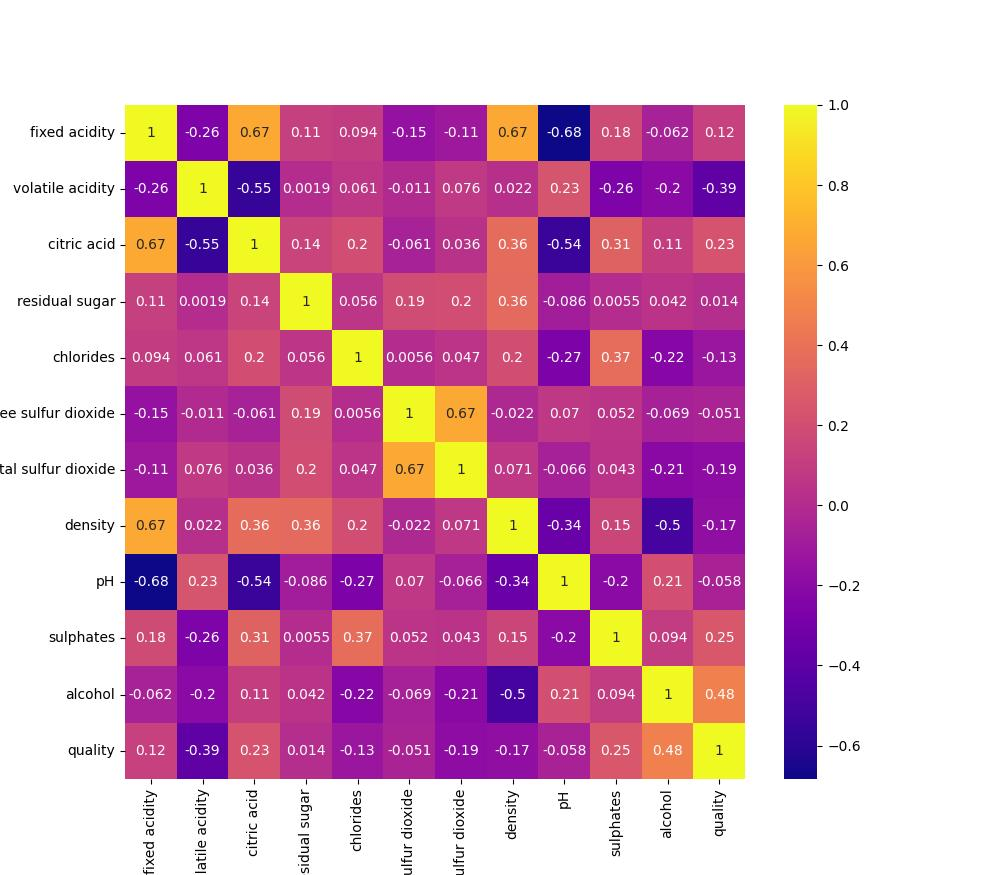
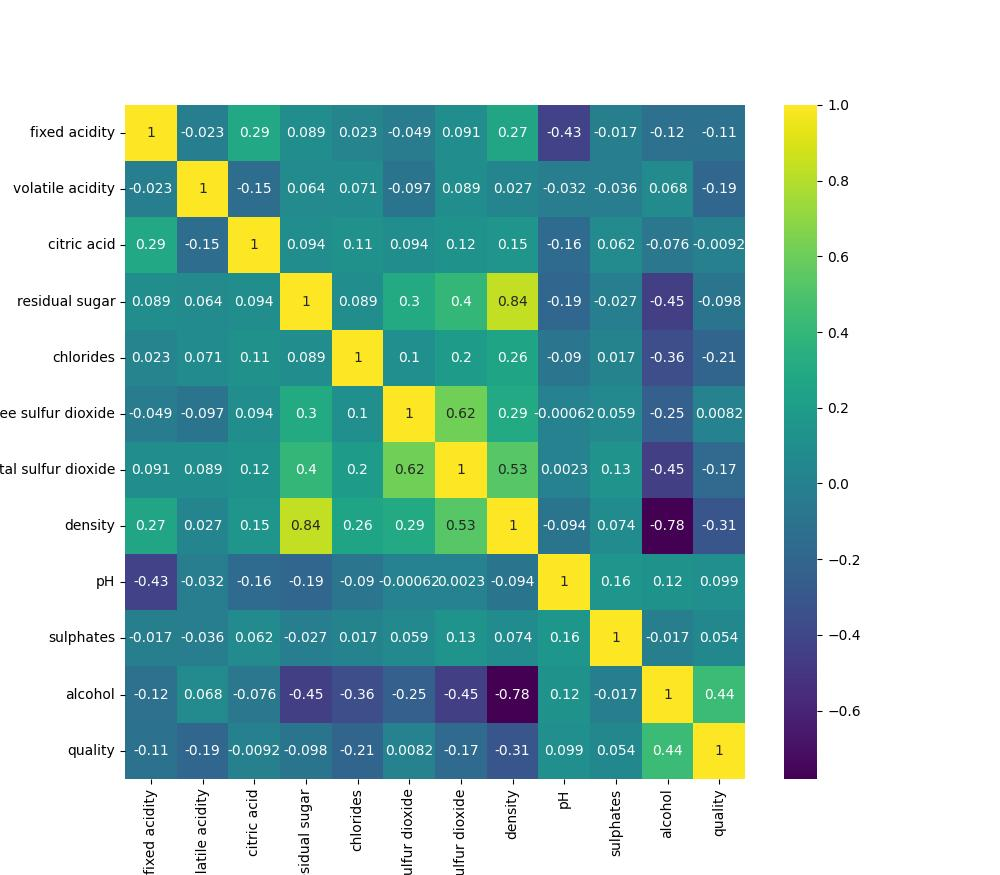

# <b>Wine Quality</b>
## <b><u>INTRODUCTION</u></b>

The aim of the project is to anaylse two datasets that tell us more about the quality of wine based on several phyicochemical properties. Due to privacy and logisitc issues, only physicochemical variables are available and seneory output varibales are available. We will explore different machine learning models to be able to predict the quality of the wine. 

## <b><u>ATTRIBUTES</u></b>

In alot of machine learning project, the attributes are represented by the columns in our dataset. For our case, we have 12 features outline below:

1. Fixed Acidity : This refers to the amount of non-volatile acids present in the wine. Primarily comes from organic acids such as tartaric acid, malic acid and citric acid. Measured in terms of grams per decimeter cubed of tartaric acid.
    
2. Volatile Acidity : This refers to the maount of volatile acids present in the wine. Primarily comes from acetic acid. These acids can easily evaporate givig of a pungent smell. Measured in terms of grams per decimeter cubed of acetic acid. 
    
3. Citric Acid : This refers to the amount of citric acid available in the wine, measured in gramers per decimeter cubed. This acid occurs naturally in grapes, providing a refreshing flavot and brightnessa and complexity to the wine. 

4. Residual Sugar : This refers to the amount of sugar remaining in the wine once the fermentation process is over. The amounf of residual sugar is upto the discretion of the wine maker. Measured in grams per decimeter cubed, residual sugar may lead to a moticable sweet taste, while a lack of it may result in dryer wines. 

5. Chlorides : Refers to the amount of chloride ions present in the wine. They may occur naturally in the wine. Chlorides enhance the perception of saltiness in the wine. Thus too much may lead to a distateful salty flavor. Measured in grams per decimeter cubed of sodium chloride. 

6. Free Sulfur Dioxide : Refers to the amount of sulfur dioxide dissolved in the wine. Sulfur dixoide is usually used a preservative and axioxidant in wines. Too much of sulfur dioxide may lead to wine with a mungent smell. Measured in milligramer per decimeter cubed. 

7. Total sulfur dioxide : Refers to the total amount of sulfur dioxide, thus the amount that is dissolved and the sulfur dioxide present due to other chemicals mixed to make the wine. Measured in milligrams per decimeter cubed. 

8. Density : This is the mass per unit volume of the wine. We are able to devise information about the solid and dissolved components in the wine with this value. It depends on factors liie residual sugar amount, alcohol content and dissolved solids. Measured in grams per cubic centimeter. 

9. pH : This is a measure of the acidity of the wine. It can depend on several factors like grape ripeness, acids present. It affects factors like the color of the wine, flavor and balance. Does not have units to express in. 

10. Sulphates : These are used as presevatives and antioxidants. They are similar to the sulfur dioxide present. Measured in grams per decimeter cubed. 

11. Alcohol : Refers to the amount of ethanol in the wine. It is a natural byproduct of the fermentation process. Measured in volume, the alcohol content is affected by the ripeness of the grape and fermetation process. It plays an importnat role in the taste, mouthfeel and warmth perception of the wine. 

The output variable is a sensory variable:

1. Quality : This is a score between 0 and 12. The higher the score, the better the quality of the wine is. 
    
## <b><u>DATA ANALYSIS</u></b>
The following steps were carried out as part of the analysis of the datasets. 
### <u>Distribution of single variables</u>

The distribution of a couple of single variables will be explored first to determine if the variables can be modeled using a normal distribution.

<ul>
  <li> 
  
Quality comparison between red and white wine : The output variable for both datasets is the  quality of the wine, which is represented by a numeric value between 0 and 12. We compare the spread of the quality data for red and white wine using a bar chart as shown below.

  
  
Modeling the Quality as a normal distribution. The distributions are made up of these parameters:  
  The mean for the quality of red wine is: 5.6360225140712945.  
  The std for the quality of red wine is: 0.807569439734705.  
  The mean for the quality of white wine is: 5.87790935075541.  
  The std for the quality of white wine is: 0.8856385749678312.   

  </li>

  <li>
  
Alcohol Content comparison between red and white wine : We want to try look at the alcohol content distribution in red and white wines as alcohol. This can be shown in the bar char below.

  
  
Modeling the Alcohol as a normal distribution. The distributions are made up of these parameters:  
  The mean for the alcohol in the red wine is: 10.422983114446529.  
  The std for alcohol in red wine is: 1.0656675818473946.  
  The mean for the slcohol in the white wine is: 10.514267047774602.  
  The std for alcohol in the white wine is: 1.230620567757318.  

  </li>

  <li>
  Density comparison between red and white wine : We want to try look at the Density distribution in red and white wines as alcohol. This can be shown in the bar char below.

  
  
From the histogram, we can see that there are two peaks for the white wine data, thus the data is bimodial, and there is one peak for the red white wine data, thus the respective data is normally distributed. The distributions are made up of these parameters:  
  The mean for the density in the red wine is: 0.9967466791744841.  
  The std for density in red wine is: 0.0018873339538425554.  
  The mean for density slcohol in the white wine is: 0.9940273764801959.  
  The std for density in the white wine is: 0.0029909069169369337.  

  </li>

  <li>
  pH comparison between red and white wine : We want to try look at the pH distribution in red and white wines as alcohol. This can be shown in the bar char below.

  
  
Modeling the pH as a normal distriution. The distributions are made up of these parameters:  
  The mean for the pH in the red wine is: 3.3111131957473416.  
  The std for pH in red wine is: 0.15438646490354277.  
  The mean for pH slcohol in the white wine is: 3.1882666394446715.  
  The std for pH in the white wine is: 0.1510005996150668.  

  </li>
</ul>

From the initial analysis above, we can see two things: The first being the fact that the red wine dataset is much smaller than the white wine dataset. Secondly, the means and standard deviations for both red and wine data are pretty similar atleast for the features shown above. This tells us that the spread of data for both wines is very similar, making the comparison one that should yeild some interesting results. 

## <u>Correlation between features and our target feature.</u>
  
Different features may be related to our target feautre (Quality) in different ways. We hope to explore these correlations here using the correlation matrix caluclated for the training, validation and tests datasets.

  
For the red wine dataset, we get the following figures to represent the correlation between the target feature (Quality) and the rest of the features.

  

    quality:                 1.000000 
    alcohol:                 0.476166 
    sulphates:               0.251397 
    citric acid:             0.226373 
    fixed acidity:           0.124052 
    residual sugar:          0.013732 
    free sulfur dioxide:    -0.050656 
    pH:                     -0.057731 
    chlorides:              -0.128907 
    density:                -0.174919 
    total sulfur dioxide:   -0.185100 
    volatile acidity:       -0.390558 
  

  
We can see the correlation matrix below, which shows the relations between all features in the datasets.

  
  
Based on the values above, we can see that for Red Wine, volatile acidity is least correlated to the quality, and the alcohol content is the most correlated. This simply hints to us that the more alcohol there is in the wine, the high the change of it being or better quality, as alcohol seems to have the greatest positive relation with quality.

  
For the white wine dataset, we get the following figures to represent the correlation between the target feature (Quality) and the rest of the features.

  

    quality:                 1.000000 
    alcohol:                 0.435575 
    pH:                      0.099427 
    sulphates:               0.053678 
    free sulfur dioxide:     0.008158 
    citric acid:            -0.009209 
    residual sugar:         -0.097577 
    fixed acidity:          -0.113663 
    total sulfur dioxide:   -0.174737 
    volatile acidity:       -0.194723 
    chlorides:              -0.209934 
    density:                -0.307123 
  

  
We can see the correlation matrix below, which shows the relations between all features in the datasets.

  
  
Based on the values above, we can see that for White Wine, density is least correlated to the quality, and the alcohol content is the most correlated 

  
For both wines, alcohol content is fairly correlated to the quality. As for the white wine, more features are negatively correlated to our target feature, telling us that there are more features whose increase may lead to a decrease in the quality of white wine. The negative correlations of white wine are stronger than those of red wine (as the values are larger negatives) further telling us that white wine may be more vulnerable to a change in quality than red wine is, such that it is easier to change the quality of white wine compared to that of red wine.

## <b><u>MACHINE LEARNING </u></b>

The data has been split in the following ways:
<li>The red wine training data has 1067 rows.</li>
<li>The red wine test data has 532 rows.</li>
<li>The white wine training data has 3266 rows.</li>
<li>The white wine test data has 1631 rows.</li>

### <u>Standardizing the data</u>

Standardization is the process of centering the data around a mean and a standard deviation of 1. I chose standardization instead of normalization as most of the values in the dataset are between 0 and 1, thus before running the machine learning models, I decided to standardize all the features.

### <u>Logistic Regression Model</u>

The first linear supervised model that is implemented is the Logistic Regression Model. I created two Logistic Regression Objects, one for the Red Wine and the other for the White Wine Data. The data used for this model was not scaled. This is because Logisitic Regression models are not sensitive to the different magnitudes of the features in the datasets.

I was able to calculate the most important features in the Red and White Wines datasets for the Logistic Regression Model. This helps us better understand the relationship between the features and the target variable. The five most important features in the Red Wine dataset are:

<ol>
  <li>volatile acidity: 3.1970</li>
  <li>pH: 2.0139</li>
  <li>fixed acidity: 1.2706</li>
  <li>chlorides: 1.174998107796296</li>
  <li>residual sugar: 1.1293050310318276</li>
</ol>
The five most important features in the White Wine dataset are
<ol>
  <li>volatile acidity: 2.3773</li>
  <li>fixed acidity: 1.5483</li>
  <li>chlorides: 1.0793</li>
  <li>total sulfur dioxide: 1.0034</li>
  <li>free sulfur dioxide: 0.5236</li>
</ol>
The model that was made to predict the Red Wine Quality has an accuracy of 0.6109, while the model that was made to predict the White Wine Quality has an accuracy of 0.5236.

### <u>Random Forest Classifier Model</u>

Another supervised learning model, I think that the Random Forest Classifier Model will work well as it reduces the risk of creating a model that over-fits the data as the final output is based on majority ranking. We use the scaled data for this model, as it is best to use scaled data for a classification model. I used a weighted average parameter while calculating the precision_score as the class distribution is imbalanced as we have a multiclass classification problem.

I was able to calculate the importance of each feature in the Red and White Wine datasets for the Random Forest Classiifer Model. The five most important features in the Red Wine dataset are:

<ol>
  <li>alcohol: 0.2846</li>
  <li>total sulfur dioxide: 0.1685</li>
  <li>sulphates: 0.1383</li>
  <li>volatile acidity: 0.1152</li>
  <li>density: 0.0812</li>
</ol>

The five most important features in the White Wine dataset are:

<ol>
  <li>alcohol: 0.2083</li>
  <li>density: 0.1369</li>
  <li>volatile acidity: 0.13628</li>
  <li>chlorides: 0.0832</li>
  <li>free sulfur dioxide: 0.0748</li>
</ol>

The precision score calculated for the Red Wine data is 0.6725, and the precision score calculated for the White Wine data is 0.6675.

### <u>SVM Model</u>

The Support Vector Machine Learning model is another supervised learning model that we use to predict the quality of Red and White Wine.
I chose this model as it is suited for datasets with large dimensions like the one we have.

I was able to calculate the importances of each feature in the Red and White Wines datasets for the SVM model. The five most important features in the Red Wine dataset are:

<ol>
  <li>density: 0.7129</li>
  <li>citric acid: 0.6689</li>
  <li>fixed acidity: 0.5481</li>
  <li>pH: 0.5346</li>
  <li>volatile acidity: 0.4818</li>
</ol>

The five most important features in the White Wine dataset are:

<ol>
  <li>residual sugar: 0.0006</li>
  <li>fixed acidity: 0.0003</li>
  <li>pH: 0.0002</li>
  <li>sulphates: 0.0001</li>
  <li>chlorides: 7.8437e-5</li>
</ol>

We can see from the values that while using the SVM model to predict the Quality of WHite Wine, the features play close to a null role in predicting the target variable. 

The score value in classiifcation problems is supposed to be a good indicator of the accuracy with which the class labels are predicted for the data points. The score for the Red Wine training dataset is 0.5998, while the score for the Red Wine test dataset is 0.5695. The score for the White Wine training dataset is 0.5034, while the score for the White Wine test dataset is 0.5695. 

## <b><u>CITATIONS</u></b>
The data sets that are cited below:
  P. Cortez, A. Cerdeira, F. Almeida, T. Matos and J. Reis. 
  Modeling wine preferences by data mining from physicochemical properties.
  In Decision Support Systems, Elsevier, 47(4):547-553. ISSN: 0167-9236.
You can find these data sets at:
    [@Elsevier] http://dx.doi.org/10.1016/j.dss.2009.05.016
    [Pre-press (pdf)] http://www3.dsi.uminho.pt/pcortez/winequality09.pdf
    [bib] http://www3.dsi.uminho.pt/pcortez/dss09.bib
