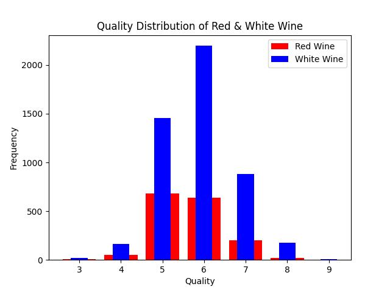

# Wine Quality
INTRODUCTION

The aim of the project is to anaylse two datasets that tell us more about the quality of wine based on several phyicochemical properties. Due to privacy and logisitc issues, only physicochemical variables are available and seneory output varibales are available. 

ATTRIBUTES

In alot of machine learning project, the attributes are represented by the columns in our dataset. For our case, we have 12 features outline below:

1. Fixed Acidity : This refers to the amount of non-volatile acids present in the wine. Primarily comes from organic acids such as tartaric acid, malic acid and citric acid. Measured in terms of grams per decimeter cubed of tartaric acid.
    
2. Volatile Acidity : This refers to the maount of volatile acids present in the wine. Primarily comes from acetic acid. These acids can easily evaporate givig of a pungent smell. Measured in terms of grams per decimeter cubed of acetic acid. 
    
3. Citric Acid : This refers to the amount of citric acid available in the wine, measured in gramers per decimeter cubed. This acid occurs naturally in grapes, providing a refreshing flavot and brightnessa and complexity to the wine. 

4. Residual Sugar : This refers to the amount of sugar remaining in the wine once the fermentation process is over. The amounf of residual sugar is upto the discretion of the wine maker. Measured in grams per decimeter cubed, residual sugar may lead to a moticable sweet taste, while a lack of it may result in dryer wines. 

5. Chlorides : Refers to the amount of chloride ions present in the wine. They may occur naturally in the wine. Chlorides enhance the perception of saltiness in the wine. Thus too much may lead to a distateful salty flavor. Measured in grams per decimeter cubed of sodium chloride. 

6. Free Sulfur Dioxide : Refers to the amount of sulfur dioxide dissolved in the wine. Sulfur dixoide is usually used a preservative and axioxidant in wines. Too much of sulfur dioxide may lead to wine with a mungent smell. Measured in milligramer per decimeter cubed. 

7. Total sulfur dioxide : Refers to the total amount of sulfur dioxide, thus the amount that is dissolved and the sulfur dioxide present due to other chemicals mixed to make the wine. Measured in milligrams per decimeter cubed. 

8. Density : This is the mass per unit volume of the wine. We are able to devise information about the solid and dissolved components in the wine with this value. It depends on factors liie residual sugar amount, alcohol content and dissolved solids. Measured in grams per cubic centimeter. 

9. pH : This is a measure of the acidity of the wine. It can depend on several factors like grape ripeness, acids present. It affects factors like the color of the wine, flavor and balance. Does not have units to express in. 

10. Sulphates : These are used as presevatives and antioxidants. They are similar to the sulfur dioxide present. Measured in grams per decimeter cubed. 

11. Alcohol : Refers to the amount of ethanol in the wine. It is a natural byproduct of the fermentation process. Measured in volume, the alcohol content is affected by the ripeness of the grape and fermetation process. It plays an importnat role in the taste, mouthfeel and warmth perception of the wine. 

The output variable in a seneory variable:

1. Quality : This is a score between 0 and 12. The higher the score, the better the quality of the wine is. 
    
DATA ANALYSIS

The following steps were carried out as part of the analysis of the datasets
1. Quality comparison between red and white wine : The output variable for both datasets is the quality of the wine, which is represented by a numeric value between 0 and 12. We compare the spread of the quality data for red and white wine using a bar chart as shown below.

    

      
    

    

CITATIONS

The data sets that are cited below:
  P. Cortez, A. Cerdeira, F. Almeida, T. Matos and J. Reis. 
  Modeling wine preferences by data mining from physicochemical properties.
  In Decision Support Systems, Elsevier, 47(4):547-553. ISSN: 0167-9236.
You can find these data sets at:
    [@Elsevier] http://dx.doi.org/10.1016/j.dss.2009.05.016
    [Pre-press (pdf)] http://www3.dsi.uminho.pt/pcortez/winequality09.pdf
    [bib] http://www3.dsi.uminho.pt/pcortez/dss09.bib
